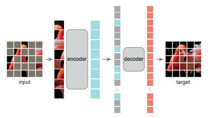

# Awesome-Masked-Autoencoder

A curated list of awesome masked autoencoder papeprs in self-supervised learning

We have currently finished a survey on masked autoencoder.

We will wrap it up as soon as possible (stay tuned!)

## Masked Image Modeling

[Masked Autoencoders Are Scalable Vision Learners](https://arxiv.org/abs/2111.06377) \
[SimMIM: A Simple Framework for Masked Image Modeling](https://arxiv.org/abs/2111.09886) \

[BEiT: Bert pre-training of image transformers](https://arxiv.org/pdf/2106.08254.pdf) \
[mc-BEiT: Multi-choice discretization for image bert pre-training](https://arxiv.org/abs/2203.15371) \
[PeCo: Perceptual codebook for bert pre-training of vision transformers](https://arxiv.org/abs/2111.12710) \
[Context autoencoder for self-supervised representation learning](https://arxiv.org/abs/2202.03026) \

[Green hierarchical vision transformer for masked image modeling](https://arxiv.org/abs/2205.13515) \
[Uniform masking: Enabling
mae pre-training for pyramid-based vision transformers with locality](https://arxiv.org/abs/2205.10063) \
[Hivit: Hierarchical vision transformer meets masked image modeling](https://arxiv.org/pdf/2205.14949) \
[Efficient self-supervised vision pretraining with local masked reconstruction](https://arxiv.org/abs/2206.00790) \
[Object-wise Masked Autoencoders for Fast Pre-training](https://arxiv.org/abs/2205.14338) \
[MixMIM: Mixed and masked image modeling for efficient visual representation learning](https://arxiv.org/abs/2205.13137) \
[MixMIM: Mixed and masked image modeling for efficient visual representation learning](https://arxiv.org/abs/2205.13137) \
[ConvMAE: Masked Convolution Meets Masked Autoencoders](https://arxiv.org/abs/2205.03892) \
[Unleash-
ing vanilla vision transformer with masked image modeling for
object detection](https://arxiv.org/abs/2205.03892) \
[Unleashing Vanilla Vision Transformer with Masked Image Modeling for Object Detection](https://arxiv.org/abs/2204.02964) \
[Architecture-Agnostic Masked Image Modeling -- From ViT back to CNN](https://arxiv.org/abs/2205.13943v2) \
[Corrupted Image Modeling for Self-Supervised Visual Pre-Training](https://arxiv.org/abs/2202.03382) \
[Are Large-scale Datasets Necessary for Self-Supervised Pre-training?](https://arxiv.org/abs/2112.10740) \
[On Data Scaling in Masked Image Modeling](https://arxiv.org/abs/2206.04664) \
[Domain Invariant Masked Autoencoders for Self-supervised Learning from Multi-domains](https://arxiv.org/abs/2205.04771) \
[MultiMAE: Multi-modal Multi-task Masked Autoencoders](https://arxiv.org/pdf/2204.01678) \
[Beyond Masking: Demystifying Token-Based Pre-Training for Vision Transformers](https://arxiv.org/abs/2203.14313) \
[Masked frequency modeling for self-supervised visual pre-training](https://arxiv.org/abs/2206.07706) \
[How to understand masked autoencoders?](https://arxiv.org/pdf/2202.03670.pdf) \
[Towards Understanding Why Mask-Reconstruction Pretraining Helps in Downstream Tasks](https://arxiv.org/abs/2206.03826) \
[MST: Masked Self-Supervised Transformer for
Visual Representation](https://arxiv.org/pdf/2106.05656) \
[RePre: Improving Self-Supervised Vision Transformer with
Reconstructive Pre-training](https://arxiv.org/pdf/2201.06857v2) \
[Contrastive Learning Rivals Masked Image Modeling in Fine-tuning via Feature Distillation
](https://arxiv.org/abs/2205.14141) \
[Siamese Image Modeling for Self-Supervised Vision Representation Learning](https://arxiv.org/abs/2206.01204) \
[iBOT: Image BERT Pre-Training with Online Tokenizer](https://arxiv.org/abs/2111.07832) \
[Masked Autoencoders are Robust Data Augmentors](https://arxiv.org/abs/2206.04846) \
[Self Pre-training with Masked Autoencoders for Medical Image Analysis](https://arxiv.org/abs/2203.05573) \
[Masked Image Modeling Advances 3D Medical Image Analysis](https://arxiv.org/abs/2204.11716) \
[Student Collaboration Improves Self-Supervised Learning: Dual-Loss Adaptive Masked Autoencoder for Brain Cell Image Analysis](https://arxiv.org/abs/2205.05194) \
[Global Contrast Masked Autoencoders Are Powerful Pathological Representation Learners](https://arxiv.org/abs/2205.09048) \
[Self-distillation Augmented Masked Autoencoders for Histopathological Image Classification
](https://arxiv.org/abs/2203.16983) \
[Masked Autoencoders Pre-training in Multiple Instance Learning for Whole Slide Image Classification](https://openreview.net/forum?id=rV5gzFDn5PF) \
[Masked Siamese ConvNets](https://arxiv.org/abs/2206.07700) \
## Beyond Images
### Videos
[BEVT: BERT Pretraining of Video Transformers](https://openaccess.thecvf.com/content/CVPR2022/papers/Wang_BEVT_BERT_Pretraining_of_Video_Transformers_CVPR_2022_paper.pdf) \
[VIMPAC: Video Pre-Training via Masked Token Prediction and Contrastive Learning](https://openreview.net/forum?id=NP9T_pViXU) \
[VideoMAE: Masked Autoencoders are Data-Efficient Learners for Self-Supervised Video Pre-Training](https://arxiv.org/abs/2203.12602) \
[OmniMAE: Single Model Masked Pretraining on Images and Videos](https://arxiv.org/abs/2206.08356) \
[Masked autoencoders as spatiotemporal learners](https://arxiv.org/abs/2206.08356) \
[MaskViT: Masked Visual Pre-Training for Video Prediction](https://arxiv.org/abs/2206.11894) \
### Vision and Language
[VLMo: Unified Vision-Language Pre-Training with Mixture-of-Modality-Experts](https://arxiv.org/abs/2111.02358) \
[An Empirical Study of Training End-to-End Vision-and-Language Transformers](https://arxiv.org/abs/2111.02387) \
[Data Efficient Masked Language Modeling for Vision and Language](https://arxiv.org/abs/2109.02040) \
[Unified-IO: A Unified Model for Vision, Language, and Multi-Modal Tasks](https://arxiv.org/abs/2206.08916) \
[VL-BEiT: Generative Vision-Language Pretraining](https://arxiv.org/abs/2206.01127) \
### Point Clouds
[Masked Autoencoders for Point Cloud Self-supervised Learning](https://arxiv.org/abs/2203.06604) \
[Masked Discrimination for
Self-Supervised Learning on Point Clouds](https://arxiv.org/pdf/2203.11183) \
[Point-M2AE: Multi-scale Masked Autoencoders for Hierarchical Point Cloud Pre-training](https://arxiv.org/abs/2205.14401) \
[Voxel-MAE: Masked Autoencoders for Pre-training Large-scale Point Clouds](https://arxiv.org/abs/2206.09900) \
### Graph
[MGAE: Masked Autoencoders for Self-Supervised Learning on Graphs](https://arxiv.org/abs/2201.02534) \
[Graph Masked Autoencoders with Transformers](https://arxiv.org/pdf/2202.08391.pdf) \
[GraphMAE: Self-Supervised Masked Graph Autoencoders](https://arxiv.org/abs/2205.10803) \
[MaskGAE: Masked Graph Modeling Meets Graph Autoencoders](https://arxiv.org/abs/2205.10053) \
[Masked Molecule Modeling: A New Paradigm of Molecular Representation Learning for Chemistry
Understanding](https://assets.researchsquare.com/files/rs-1746019/v1_covered.pdf?c=1656528248) \
### Audio
[Masked Spectrogram Modeling using Masked Autoencoders for Learning General-purpose Audio Representation](https://arxiv.org/abs/2204.12260) \
[MAE-AST: Masked Autoencoding Audio Spectrogram Transformer](https://arxiv.org/pdf/2203.16691v1) \
[Masked Autoencoders that Listen](https://arxiv.org/abs/2207.06405)
[Group masked autoencoder based density estimator for audio anomaly detection](https://assets.amazon.science/3b/a3/a1dd903b4636a238c242d7af84bd/group-masked-autoencoder-based-density-estimator-for-audio-anomaly.pdf)
### Reinforcement Learning
[Masked Visual Pre-training for Motor Control](https://arxiv.org/abs/2203.06173) \
[Masked World Models for Visual Control](https://arxiv.org/abs/2206.14244) \
### Others
[Time Series Generation with Masked Autoencoder](https://arxiv.org/abs/2201.07006) \
[MET: Masked Encoding for Tabular Data](https://arxiv.org/abs/2206.08564) 
